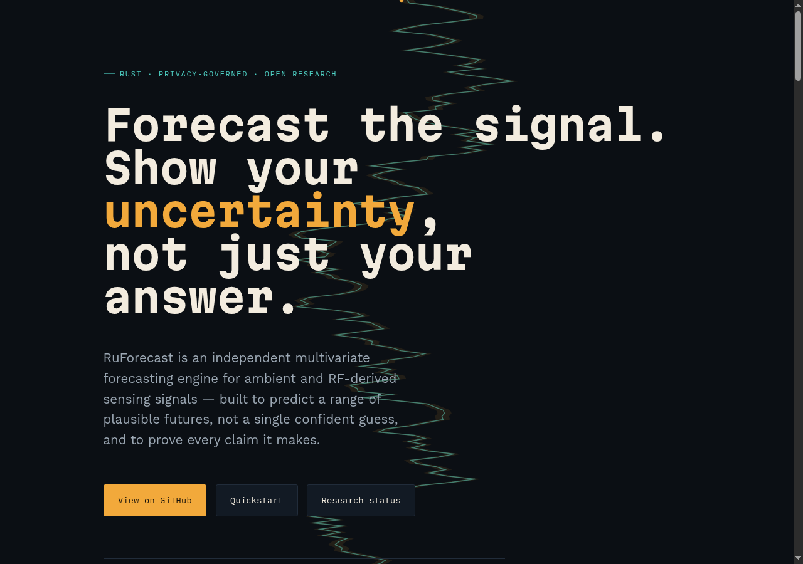

# RuForecast

**Independent, privacy-governed multivariate time-series forecasting in Rust.**

[](https://ruvnet.github.io/RuForecast/)
[](#license)
[](#requirements)

[](https://ruvnet.github.io/RuForecast/)

**[▶ See the full story on the live site](https://ruvnet.github.io/RuForecast/)**

---

## What is RuForecast?

RuForecast predicts what a set of related signals will do next — not as one confident number, but as a *range* of plausible outcomes. Give it a window of recent readings across several coupled variates (heart rate, breathing rate, signal quality, presence, motion — anything time-series and correlated), and it forecasts each one forward, honestly ranked from "very likely" to "possible but unlikely."

It grew out of [RuView](https://github.com/ruvnet/wifi-densepose), a camera-free WiFi-sensing project, but the model, training pipeline, and governance machinery here are domain-general — nothing in this repository is specific to WiFi or RF sensing.

## Why it's built this way

Most forecasting tooling optimizes for a single accuracy number and hides everything else. RuForecast takes the opposite bet:

- **Uncertainty is the product, not a footnote.** Every prediction ships as seven ordered quantiles, ready to build a real interval — not a point estimate with an implied "trust me."
- **Privacy is a type, not a policy document.** Every training request carries a declared privacy class, tenant scope, retention window, and consent record — checked before training runs, not after an incident.
- **A hyperparameter improvement has to prove itself.** Search results are cryptographically verified against fresh, out-of-search data before anything is trusted — see [Governance](#governance-search-and-verification) below.
- **Every accuracy claim is tagged.** This project's own rule, applied to itself: `MEASURED` (with a reproducer), `CLAIMED`, or `SYNTHETIC`. Read [Research status](#research-status-read-this-first) before you trust a number from this repo.

## Features

| | |
|---|---|
| **Multivariate, coupled** | Permutation-equivariant variate attention — any number of correlated input signals, not one series at a time. |
| **Quantile output** | Seven ordered quantiles per prediction; supports real interval coverage, not just a mean/point forecast. |
| **Missing data as a first-class input** | Observation masks are modeled directly, not silently imputed away before the network sees them. |
| **Three backends, one architecture** | CPU (`ndarray`) for portability and CI, CUDA for Linux/NVIDIA training, WGPU for cross-platform GPU inference — same model, feature-gated at compile time. |
| **Clean-room model** | No borrowed weights, no wrapped third-party checkpoint — masked patch tokens, gated depthwise temporal mixing, variate attention, and an ordered-quantile head, described in [ADR-348](docs/adr/ADR-348-independent-rust-multivariate-forecasting.md). |
| **Local + hosted training** | Train locally from typed JSONL, or orchestrate a synthetic-only, governed run on fal.ai — see [ADR-349](docs/adr/ADR-349-governed-local-and-fal-forecast-training.md). |
| **`#![forbid(unsafe_code)]`** | The model crate carries zero unsafe blocks, and stays usable (config + artifact validation) even with every ML backend feature disabled. |

## Benefits

- **No opaque forecasts.** Downstream systems can act on a range, abstain on low confidence, or treat a widening interval as a signal in its own right.
- **Governed by construction.** Privacy and retention rules are enforced by the type system at training time, not a checklist someone has to remember.
- **Verifiable, not just tested.** A promoted hyperparameter change carries a signed, replayable evaluation receipt — anyone can independently re-check the claim that it beat its parent.
- **Runs where your hardware already is.** The same architecture compiles for a CI runner's CPU, a training rig's GPU, or a portable WGPU target.

## Usage

### Requirements

Rust 1.89+ (contracts/metrics, no GPU toolchain needed) or 1.92+ if you want the full Burn-based training/inference path. A CUDA toolchain only if you're using the `cuda` feature.

### Quickstart — train and evaluate locally

```bash
git clone https://github.com/ruvnet/RuForecast.git
cd RuForecast

# build the CLI (CPU backend)
cargo build --release -p ruforecast-train --no-default-features --features cpu,cli --bin ruforecast

BIN=./target/release/ruforecast

# generate a synthetic dataset (governed, local-only, never real data)
$BIN prepare-synthetic-dataset --directory ./run --train-windows 24 --test-windows 8

# train a candidate on it
$BIN train-local --request ./run/train-local.toml --dataset-root ./run --output ./run/artifacts

# score it against the trivial baselines it has to beat
$BIN evaluate \
  --candidate ./run/artifacts/synthetic-dataset/model.mpk \
  --test-jsonl ./run/test.jsonl
```

`evaluate` reports weighted quantile loss (overall and per-horizon-step), 80% interval coverage, and missingness — for your trained model *and* for last-value and seasonal-naive baselines, side by side, so a claimed improvement is always shown next to what it has to beat.

### As a library

```toml
[dependencies]
ruforecast-core = "0.1"
ruforecast-model = { version = "0.1", features = ["cpu"] }
```

`ruforecast-core` is Burn-free — types, splits, metrics, and privacy policy resolve without pulling in any ML backend. `ruforecast-model` adds the network itself behind feature flags (`cpu`, `cuda`, `wgpu`).

## Architecture

```
ruforecast-core    Series, temporal splits, quantile metrics, typed privacy policy
       │            (no ML backend dependency — validates independently)
       ▼
ruforecast-model   The network: masked patches → temporal mixing → variate
       │           attention → ordered-quantile head. CPU/CUDA/WGPU backends.
       ▼
ruforecast-train   Local + fal.ai training orchestration, the `ruforecast` CLI
```

See [ADR-348](docs/adr/ADR-348-independent-rust-multivariate-forecasting.md) for the full architecture rationale, [ADR-349](docs/adr/ADR-349-governed-local-and-fal-forecast-training.md) for the training/deployment governance model, the [threat model](docs/security/ruview-forecast-threat-model.md) and [clean-room record](docs/security/ruview-forecast-clean-room.md) for the security posture, and the [model-card template](docs/huggingface/RUVIEW_FORECAST_MODEL_CARD_TEMPLATE.md) for what a released model's documentation is required to cover.

## Governance: search and verification

Two companion, governed pipelines pair with RuForecast — neither ships in this repository, both are real and open-source:

- **[Darwin Mode](https://github.com/ruvnet/metaharness)** searches the hyperparameter space, scoring each candidate's held-out weighted quantile loss across multiple *independent* synthetic corpora, so a search can't quietly overfit to one fixed dataset.
- **[Autogenous](https://github.com/ruvnet/autogenous)** cryptographically verifies a candidate before it's trusted: signed evaluation receipts from independent judges, on data the search never saw, beating the parent by a real margin — a candidate cannot promote itself.

## Research status — read this first

**No configuration has yet been shown to reliably beat trivial forecasting baselines (last-value, seasonal-naive) out-of-sample.**

Two independent hyperparameter searches were run against this model, each cryptographically verified against fresh, out-of-search synthetic data. Both searches' "winning" configuration failed independent verification — at the current small training-corpus scale (24 synthetic windows), dataset noise dominates any real hyperparameter effect. Neither result held up.

This is reported here, on purpose, in the README — not buried in an issue tracker. The full evidence for both search rounds, including the retraction, is in [`docs/benchmarks/ruforecast.md`](docs/benchmarks/ruforecast.md). The credible next lever is real training data volume, not further search on a small synthetic fixture — that work is active.

## Repository layout

```
crates/ruforecast-core/    Backend-neutral contracts, metrics, privacy policy
crates/ruforecast-model/   The forecasting network (Burn-based)
crates/ruforecast-train/   Training orchestration + the `ruforecast` CLI
docs/adr/                  Architecture decision records
docs/benchmarks/           Accuracy protocol and the evidence ledger
docs/security/             Threat model and clean-room provenance record
docs/site/                 Source for the GitHub Pages site
```

## Contributing

Issues and pull requests are welcome. Given the [research status](#research-status-read-this-first) above, contributions that extend real training data, tighten the accuracy-evaluation protocol, or improve the governance pipeline are especially useful right now.

## License

Licensed under either of [MIT](LICENSE-MIT) or [Apache-2.0](LICENSE-APACHE) at your option.
